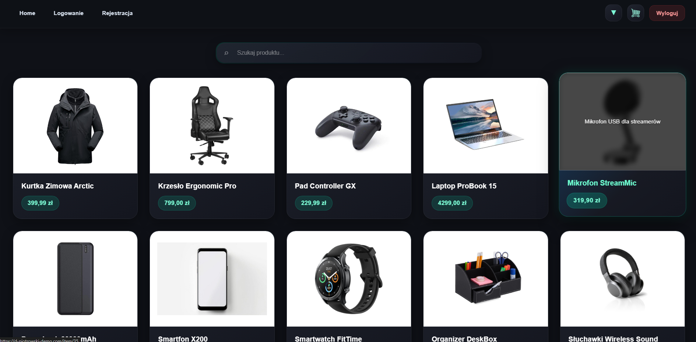

# MiniEcommerce

Full-stack e-commerce web application built as a portfolio project to demonstrate backend, frontend, authentication, database management, and cloud deployment skills.

The project focuses on secure API communication, scalable architecture, and production-like deployment workflow.

---

## 🚀 Live Demo

**Frontend**  
d-piotrowski-demo.com

**Backend API**  
miniecommerceapi-hbdedmhyc3c7d3bf.polandcentral-01.azurewebsites.net

---

## 📖 Project Overview

MiniEcommerce is a full-stack web application that simulates a modern online store.

The project was created to practice real-world software engineering concepts including:

- REST API development  
- Authentication and authorization  
- Secure token handling  
- Database design and management  
- Frontend state management  
- Cloud deployment pipeline  
- Production environment configuration  

The main goal of the project was to build an application that resembles a real production-ready business system instead of a simple tutorial project.

---

## 🛠 Tech Stack

### Backend

- C#
- ASP.NET Core Web API
- Dapper
- JWT Authentication
- Refresh Token Mechanism
- CSRF Protection
- MySQL
- Custom Middleware
- Dependency Injection

### Frontend

- React
- JavaScript
- React Router
- CSS3
- Fetch API
- Local Storage Management

### Infrastructure

- Microsoft Azure App Service
- Azure Static Web Apps / Azure App Service
- GitHub Actions CI/CD
- Custom Domain Configuration

---

## ✨ Features

### User Features

- User registration
- User login/logout
- JWT authentication
- Secure API communication
- Product browsing
- Search products
- Product details page
- Shopping cart management
- Persistent cart storage using localStorage

### Security Features

- JWT Access Token authentication
- HTTP-only refresh token cookies
- CSRF token validation
- Protected API endpoints
- Password hashing

### Technical Features

- Backend API architecture
- Frontend routing
- Environment variable configuration
- Custom error handling middleware
- Deployment pipeline with GitHub Actions

---

## 🏗 Architecture

Application consists of two independent parts:

### Frontend

React application responsible for UI rendering and user interactions.

### Backend

ASP.NET Core Web API responsible for authentication, business logic, and database communication.

### Database

MySQL database storing users, products, and order-related data.

### Deployment

Frontend and backend deployed independently on Microsoft Azure.

---

## ⚙ Technical Challenges Solved

During development I worked on solving several real-world engineering problems.

### Authentication Flow

Implemented JWT authentication with secure token storage and protected API endpoints.

### CSRF Protection

Implemented CSRF validation mechanism for state-changing HTTP requests.

### Cross-Origin Communication

Configured CORS policy for frontend and backend hosted on separate domains.

### Production Deployment

Configured deployment pipeline using GitHub Actions and Microsoft Azure cloud services.

### Environment Configuration

Managed environment variables for local and production environments.

---

## 📷 Screenshots

### Homepage

[INSERT SCREENSHOT HERE]

Example:

### Product Page

[INSERT SCREENSHOT HERE]

### Cart

[INSERT SCREENSHOT HERE]

### Login Page

[INSERT SCREENSHOT HERE]

---

## 📂 Project Structure

### Backend

/backend

- Controllers  
- Services  
- Middleware  
- Models  
- Authentication  
- Database  

### Frontend

/frontend

- Pages  
- Components  
- Hooks  
- API Services  
- Routing  

---

## 🔮 Future Improvements

Planned improvements:

- Admin panel
- Product management dashboard
- Unit testing
- Order management
- Email notifications
- Payment integration
- Better responsive design
- Internationalization (i18n)

---

## ▶ Running Locally

### Backend

bash
dotnet run

###Frontend
npm install
npm run dev

###Database

Configure MySQL connection string in appsettings.json

📚 What I Learned

During this project I gained practical experience in:

Building REST APIs
Authentication systems
Secure web application design
Cloud deployment
CI/CD workflows
Full-stack architecture design
Database integration
Production debugging

👤 Author

Damian Piotrowski

GitHub
https://github.com/DPiotrowski00

LinkedIn
https://www.linkedin.com/in/damian-piotrowski-b8969734b/
