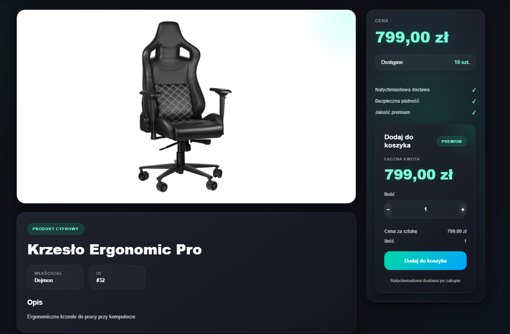
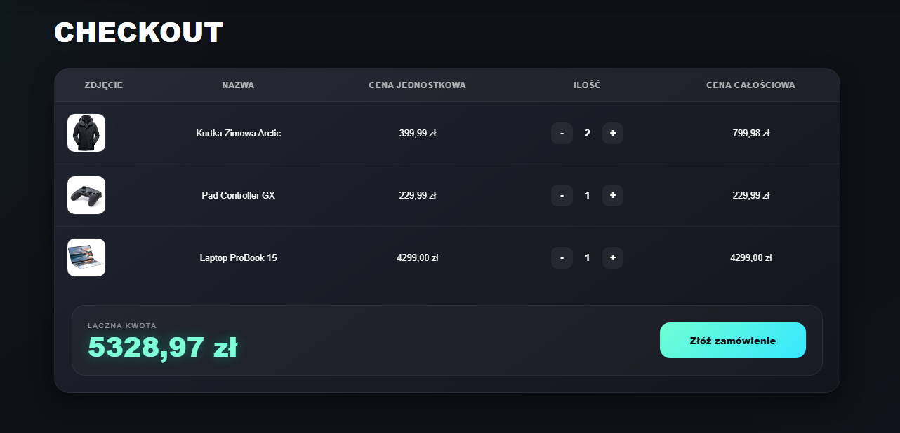
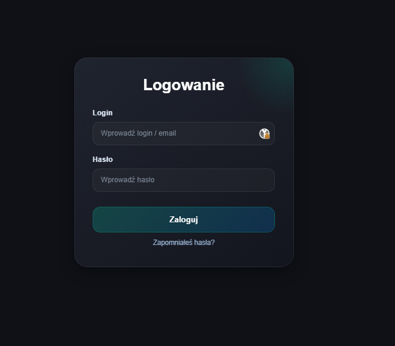

# MiniEcommerce


Full-stack e-commerce application focused on secure API communication, authentication mechanisms, database integration, and cloud deployment architecture.

The project was built to simulate production-like application architecture rather than a simple tutorial-based portfolio project.

---

## 🚀 Live Demo

### Frontend  
🔗 **Demo**  
[Live Demo](https://d-piotrowski-demo.com)

---

## 📖 Project Overview

MiniEcommerce is a full-stack web application that simulates a modern online store.

The project was created to gain hands-on experience with real-world software engineering concepts, including:

- REST API development  
- Authentication and authorization  
- Secure token handling  
- Database design and management  
- Frontend state management  
- Cloud deployment pipeline  
- Production environment configuration  

The main goal was to build an application resembling a real business-oriented production system rather than a basic CRUD tutorial project.

---

## 🛠 Tech Stack

### Backend

- C#
- ASP.NET Core Web API
- Dapper
- JWT Authentication
- Refresh Token Mechanism
- CSRF Protection
- MySQL
- Custom Middleware
- Dependency Injection

### Frontend

- React
- JavaScript
- React Router
- CSS3
- Fetch API
- Local Storage Management

### Infrastructure

- Microsoft Azure App Service
- Azure Static Web Apps
- Azure App Service
- GitHub Actions CI/CD
- Custom Domain Configuration

---

## ✨ Features

### User Features

- User registration
- User login/logout
- Product browsing
- Product searching
- Product details page
- Shopping cart management
- Persistent cart storage using localStorage

### Security Features

- JWT Access Token authentication
- HTTP-only Refresh Token cookies
- CSRF token validation
- Protected API endpoints
- Password hashing

### Technical Features

- Backend API architecture
- Frontend routing
- Environment variable configuration
- Custom error handling middleware
- Deployment pipeline with GitHub Actions

---

## 🏗 Architecture

Application consists of independent frontend and backend services.

### Frontend

React application responsible for UI rendering and client-side interactions.

### Backend

ASP.NET Core Web API responsible for authentication, business logic, and database communication.

### Database

MySQL database storing users, products, and order-related data.

### Deployment

Frontend and backend deployed independently on Microsoft Azure cloud infrastructure.

---

## ⚙ Technical Challenges Solved

During development I worked on solving several real-world engineering problems.

### Authentication Flow

Implemented JWT authentication with secure token generation, storage, and protected API endpoints.

### CSRF Protection

Implemented CSRF validation mechanism protecting state-changing HTTP requests.

### Cross-Origin Communication

Configured CORS policy for frontend and backend hosted on separate domains.

### Production Deployment

Configured automated deployment pipeline using GitHub Actions and Microsoft Azure cloud services.

### Environment Configuration

Managed separate local and production environment configuration using environment variables.

---

## 📷 Screenshots

### Homepage


### Product Page



### Shopping Cart



### Login Page



---

## 📂 Project Structure

### Backend

```text
/backend
 ├── Controllers
 ├── Services
 ├── Middleware
 ├── Models
 ├── Authentication
 └── Database
```

### Frontend

```text
/frontend
 ├── Pages
 ├── Components
 ├── Hooks
 ├── API Services
 └── Routing
```

---

## 🔮 Future Improvements

Planned improvements:

- Admin panel
- Product management dashboard
- Unit testing
- Order management
- Email notifications
- Payment integration
- Better responsive design
- Internationalization (i18n)

---

## ▶ Running Locally

### Backend

```bash
dotnet run
```

### Frontend

```bash
npm install
npm run dev
```

### Database Setup

1. Import `dbSchema.sql` into MySQL  
2. Populate the `statuscodes` table with initial data  

Example:

```sql
INSERT INTO statuscodes (Name) VALUES ('In progress');
```

3. Configure MySQL connection string in `appsettings.json`

---

## 📚 What I Learned

During this project I gained practical experience in:

- Building REST APIs  
- Authentication systems  
- Secure web application design  
- Cloud deployment  
- CI/CD workflows  
- Full-stack architecture design  
- Database integration  
- Production debugging  
- Managing frontend/backend communication across separate domains  

---

## 👤 Author

### Damian Piotrowski

🔗 GitHub  
[GitHub Profile](https://github.com/DPiotrowski00)

🔗 LinkedIn  
[LinkedIn Profile](https://www.linkedin.com/in/damian-piotrowski-b8969734b/)
